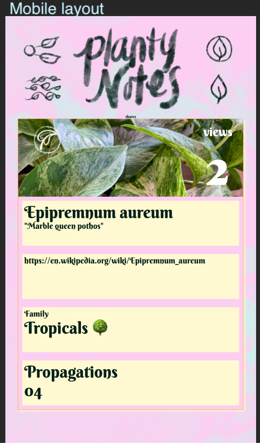

## Static comp solo challenge
A static comp to practice CSS and HTML

### Screenshot of static layout

### View the deployed site here:
[🌳 planty notes 🌵](https://nichelicorn.github.io/planty-notes/)

### Screenshot of static comp

### Learning goals
* Create a basic static static website with responsive design layouts
* Match the layout of the comp (creative license granted on copy and images)
* Practice using grid vs. flexbox
* Gain a better understanding of responsive design
* Use a normalize file to allow cross-browser compatibility

## Author
<table>
    <tr>
        <td> Nichele Dunn <a href="https://github.com/nichelicorn">GH</td>
    </tr>
    </tr>
        <td></td>
    </tr>
</table>

## Technologies
<table>
    <tr>
        <td>Structure</td>
        <td>Styling</td>
    </tr>
    </tr>
        <td></td>
        <td></td>
    </tr>
</table>
